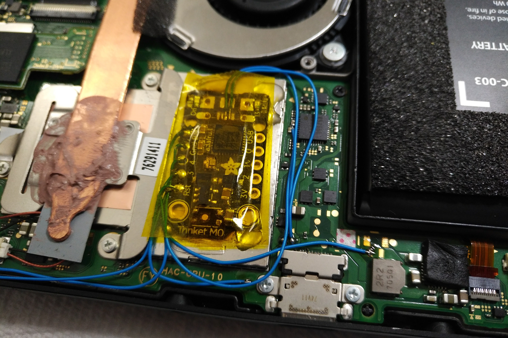

# Teardown

I am not going to detail the full teardown of the Nintendo Switch as you can
find videos and pictures online, but the gist of it goes like this:

* Remove the 4 triwing screws on the back panel
* Remove the screw at the top next to the fan output
* Remove the two screws next to the USB port (These screws are DIFFERENT than
  the previous one, keep them seperate)
* Remove the screw just below the SD card slot
* Remove the middle screw on both joycon rails

The back panel should now come off.

* Remove the screw holding in the MicroSD board
* Carefully remove the MicroSD board
* Remove all the screws holding the metal shield in place

The metal shield should come off easily.

**Unplug the battery from the switch.**

# Modifying the Trinket

## Removing the microusb port

You should probably remove the microusb port from the Trinket. I used a hot air
gun to achieve this. Be careful, because there are a few bits that go into the
board that might make it more difficult to remove.

## Muting the power LED light

Remove the power LED or the resistor next to the power LED. This is next to the
microusb port with a silkscreen that says "On". This is a waste of power if you
leave this on.

## Remove reset switch (Optional, reduce height)

If you want to be able to put the metal shield back on the switch, you will
need to remove the reset switch. If you keep the metal shield off you can
actually press the reset switch through the rear plastic case. This is only
useful to get into bootloader mode, which should be obsolete once a proper
chainloader is released.

## Replace power capacitors (Optional, reduce height)

My Trinket came with very tall ceramic capacitors on the voltage regulator.
Because of this I couldn't fit the metal shield over the Trinket.  The height
of the capacitors may vary depending on the production run of the Trinket.

These are the two ceramic capacitors nearest the reset switch. If your
capacitors are too tall you can replace them. The Adafruit schematic calls for
10uF capacitors, I replaced them with 22uF because that's what I had
immediately available.

# Installing the Trinket

## Affix and solder Trinket

Now it is time to install the Trinket. Make sure the battery is **unplugged**
from the Switch.

Refer to the following picture for recommended placement of the Trinket.

Insulate and affix the Trinket to the metal shield. I used some Kapton tape to
insulate and put a couple dabs of hot glue in the corners. xboxexpert used some
double sided tape to affix his mod (pictured).

Carefully wire up the Trinket as shown in the picture using some thin wire. Be
very careful with the point on the capacitor, and be very careful not to bridge
it with the adjacent capacitor.

## Install `RCM_STRAP` wire (Optional)

If you want to continue using a modded joycon or jig, feel free to skip this
step. Even if you have a modded joycon, the advantage of this step is that the
Trinket will disconnect itself from the `RCM_STRAP` line and should be
undetectable after boot.

* Carefully remove the right joycon rail ribbon from the connector

  Note that you must release the latch before you remove the ribbon. Carefully
lift the latch on the "north side" of the connector. It is **VERY** fragile.

* Remove all screws from the right joycon rail and remove it.

Caution, these screws strip easily!

The following picture shows where you want to solder a wire to in order to
access `RCM_STRAP`.

Be careful, as my pins wanted to lift off the small PCB very easily with any
applied heat, use some flux and solder it quickly.

If you have difficulty you can remove the PCB and ribbon cable from the rail by
pushing the small metal pin out (like adjusting a watch band) to release it.

* Re-assemble the joycon rail
* Reconnect the ribbon cable
* Connect the other end of that wire to pin 3 of the Trinket

# Test the mod

Feel free to connect the battery and test the mod. If you installed the
`RCM_STRAP`, then you just need to hold Vol+ and press power. Otherwise use
your joycon or jig to pull enable RCM. The Trinket should wake itself up and
inject the payload.

See Status Lights and Troubleshooting sections below if you are having issues.

# Reset wire?

You might want to consider running a wire from the "Reset" pin out the
kickstand opening. Touching this wire to the metal shield (which you can do
from the outside) will let you put the Trinket in bootloader mode and you can
reflash it. Other options are an internal magnetic reed switch, or a physical
switch installed somewhere.

The rear panel of the Switch is quite flexible, making a reset switch pushable
just by pushing the back. Use your imagination.

Note that once a proper open source payload chainloader payload is created, the
Trinket should *theoretically not have to be flashed anymore*.

# Reassemble switch

Make sure you insulate the top of the Trinket if you are installing the metal
shield.

Put it back together and hope you don't have any screws left over.

# Status Lights

This is the order of what happens when you turn the switch on:

1. Switch turned on
2. Trinket woken up, `RCM_STRAP` pulled to GND, shows GREEN light for 1 second
3. Trinket reboots itself (because I'm lazy), LED turns PURPLE.
4. Trinket looks for RCM device, blinks while looking
6. RCM found? Injects payload, shows GREEN led for 0.5 second
7. RCM not found? shows RED led for 0.5 second
8. Trinket goes to sleep and waits for the Switch to turn on again

# Troubleshooting

* Trinket never injects payload

  Did you mix up D+ and D-?

* Trinket doesn't turn on

  It should turn on when you plug the Switch battery back in. Check `Bat` and
`Gnd`

* Trinket doesn't do anything when Switch is turned on

  Check that pin 4 is connected to the cap without shorting anything

# Pictures of my installation

